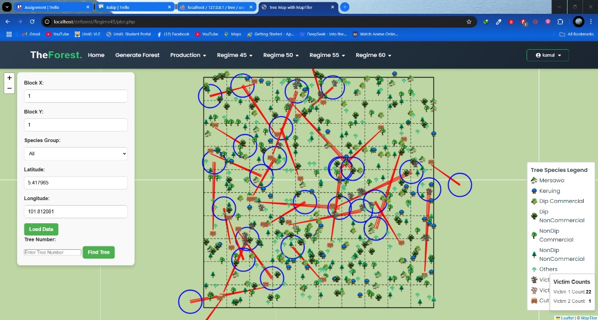
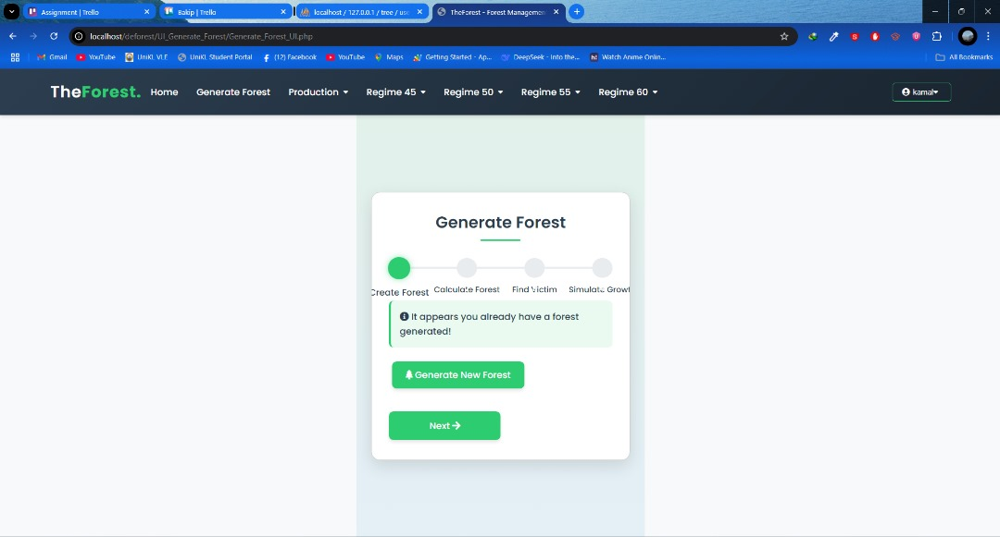
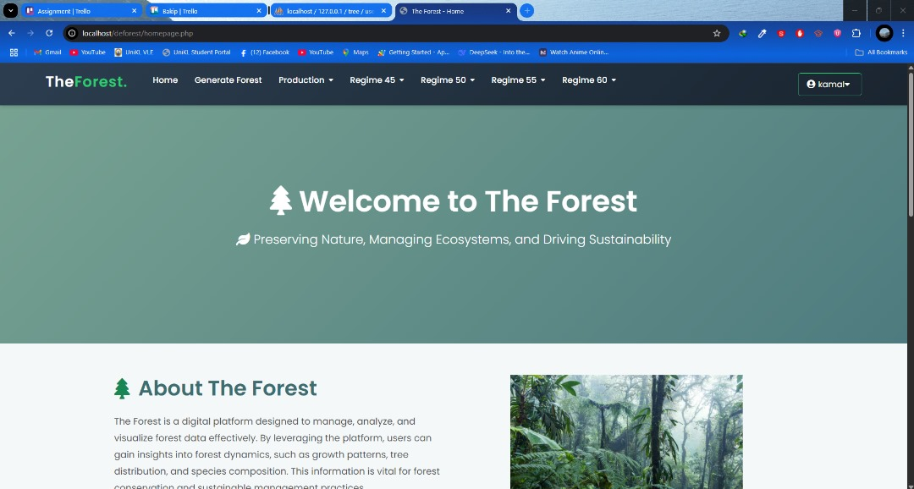
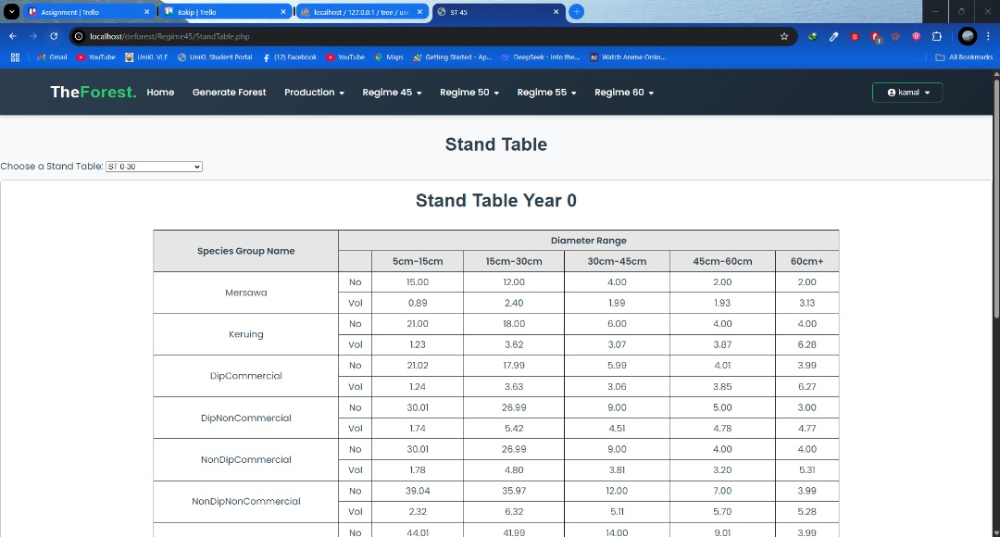

# Deforestation Analysis System

A web-based forest management and analysis system for tracking tree data, simulating forest growth, and visualizing deforestation patterns.

## Screenshots

### Interactive Forest Map

*Interactive map showing tree locations, status, and cutting patterns*

### Forest Generation Interface

*User interface for generating and configuring forest parameters*

### Data Analysis Dashboard

*Main dashboard showing forest statistics and regime analysis*

### Species Group Analysis

*Detailed view of different species groups and their distribution*

## Features

- Interactive forest map visualization using MapTiler
- Tree data management and tracking
- Growth simulation and analysis
- Multiple viewing regimes (45, 50, 55, 60 years)
- Species group filtering and analysis
- Forest damage calculation and updates

## Setup Instructions

### Prerequisites

- Web server (Apache, Nginx, or similar)
- PHP 7.0 or higher
- MySQL/MariaDB database
- Modern web browser

### Installation

1. Clone this repository to your web server directory:
   ```bash
   git clone <your-repo-url> /path/to/your/webserver/deforest
   ```

2. **Configure API Keys:**
   - Copy `config.sample.js` to `config.js`
   - Edit `config.js` and replace `YOUR_MAPTILER_API_KEY_HERE` with your actual MapTiler API key
   - Get your MapTiler API key from: https://www.maptiler.com/

3. **Database Setup:**
   - Create a MySQL database for the project
   - Update database connection settings in `db_connection.php`
   - Import your database schema (if available)

4. **File Permissions:**
   - Ensure your web server has read/write permissions to the project directory

### Configuration

The project uses a configuration file approach to handle sensitive data:

- `config.js` - Contains your actual API keys (ignored by Git)
- `config.sample.js` - Template file for configuration (committed to Git)

**Important:** Never commit your actual `config.js` file to version control.

### Usage

1. Access the application through your web browser
2. Navigate to different sections:
   - `homepage.php` - Main dashboard
   - `plot/plot.html` - Interactive forest map
   - `UI_Generate_Forest/` - Forest generation tools
   - Various regime folders for different analysis periods

### File Structure

```
deforest/
├── plot/                  # Interactive map visualization
├── Regime45-60/          # Different time period analyses
├── UI_Generate_Forest/   # Forest generation interface
├── GraphBar/            # Data visualization components
├── icon/                # UI icons and images
├── config.js            # API keys (not in Git)
├── config.sample.js     # Configuration template
└── *.php               # Core PHP files
```

### Contributing

1. Fork the repository
2. Create a feature branch
3. Make your changes
4. Ensure `config.js` is not committed
5. Submit a pull request

### Adding Screenshots

To update the screenshots in this README:

1. Navigate to the `screenshots/` directory
2. Read the `screenshots/README.md` for detailed instructions
3. Take screenshots of the key features:
   - Interactive forest map (`forest-map.png`)
   - Forest generation interface (`forest-generation.png`) 
   - Main dashboard (`dashboard.png`)
   - Species analysis view (`species-analysis.png`)
4. Save images with the exact filenames specified
5. The README will automatically display the updated screenshots

### Security

- API keys are stored in `config.js` which is ignored by Git
- Never commit sensitive configuration data
- Use environment variables for production deployments

### License

[Add your license information here]
